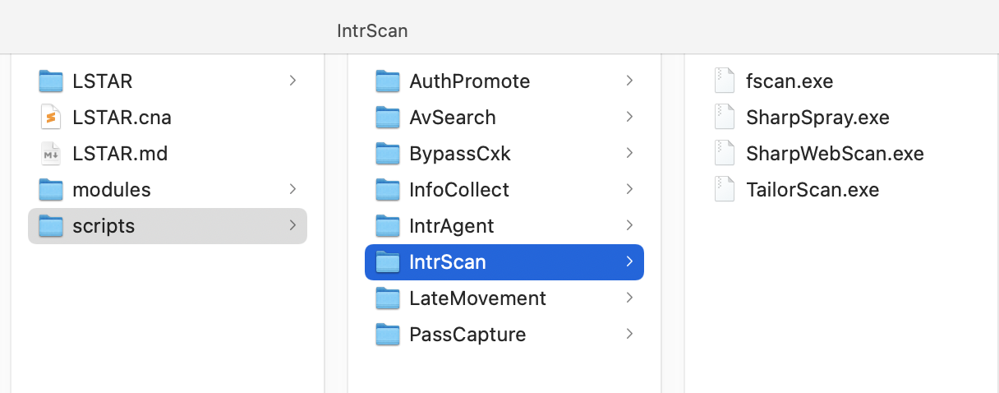

# LSTAR - Aggressor

**本着简化 CS 右键和方便自己集成的目的，对 Reference 里的项目进行了缝合以及二次开 (抄) 发 (袭)** 

**并添加了 Cxk 限时免杀的 mimikatz 和 adduser 等功能**

**项目树较为简单直观 且方便 DIY：**

**由于作案时间有限 很多功能待实战测试去除和优化**

# Reference

[**梼杌 - taowu-cobalt-strike**](https://github.com/pandasec888/taowu-cobalt-strike)

[**Z1-AggressorScripts**](https://github.com/z1un/Z1-AggressorScripts)

[**九世自开 csplugin**](https://github.com/422926799/csplugin)

[**A-Team CobaltStrike-Toolset**](https://github.com/QAX-A-Team/CobaltStrike-Toolset)

# 2021.08.11 更新

## InfoCollect

新增 CheckVM 检测目标是否为虚拟机

## AVSearch

由于之前的脚本有一定概率失败：

更新了新的检测杀软方式

## AuthPromote

**修复了之前提权模块的 BUG**

## PassCapture

### Mimikatz 相关

### Lazagne

**实战测试比较好用的检索主机密码工具 （上传运行后会自动删除 exe 文件）**

### 浏览器密码

### Navicat Xshell 等本机软件

### FakeTheScreen

**优化了针对 Windows10和 Windows7不同的钓鱼密码窃取**

**由于伪造页面效果一言难尽，只建议在准备鱼死网破时使用：**

## AboutMe

**添加了 AboutMe 帮助菜单**

**方便跳转 凌星阁**

# InfoCollect

添加了 Netview 和 Powerview 功能

# AvSearch

# IntrScan

自定义指令运行

fscan 默认上传至 **`C:\\Users\\Public\\`**

控制台返回

删除 fscan 及结果文本

# IntrAgent

# AuthPromote

# AuthMaintain

# PassCapture

# LateMovement

# TraceClean

# BypassCxk

# HavingFun

