# LSTAR - Aggressor

**本着简化 CS 右键和方便自己集成的目的，对 Reference 里的项目进行了缝合以及二次开 (抄) 发 (袭)** 

**并添加了虚拟机/AV 检测、主机相关密码抓取、 Cxk 限时免杀的 mimikatz 和 adduser 等功能**

**项目树较为简单直观 且方便 DIY：**

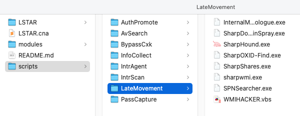

>**CobaltStrike 主机上线微信通知插件：**
>
>**如果想使用免费且支持微信模板消息推送的方式可以移步：https://github.com/lintstar/CS-PushPlus**
>
>**如果有订阅 ServerChan 的企业微信推送通道可以移步：https://github.com/lintstar/CS-ServerChan**

# 2021.08.11 更新

## InfoCollect

新增 CheckVM 检测目标是否为虚拟机

## AVSearch

由于之前的脚本有一定概率失败：

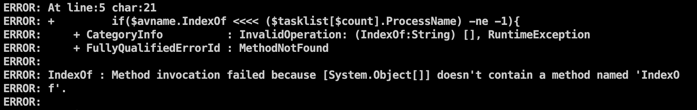

更新了新的检测杀软方式

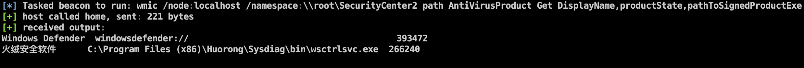

## AuthPromote

**修复了之前提权模块的 BUG**

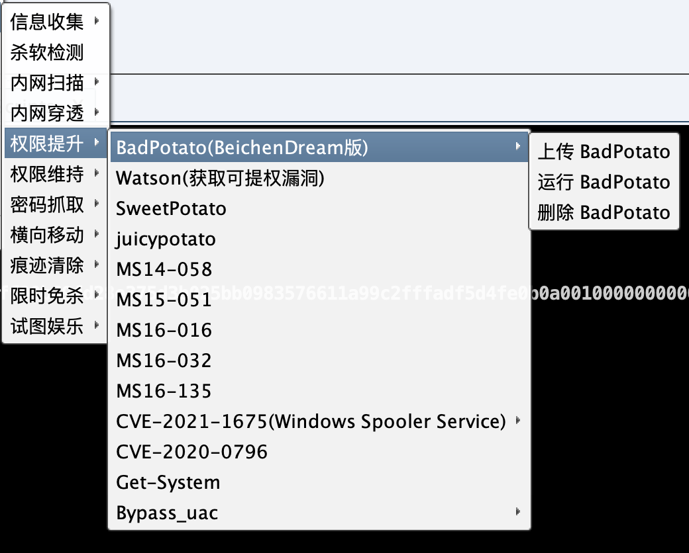

## PassCapture

### Mimikatz 相关

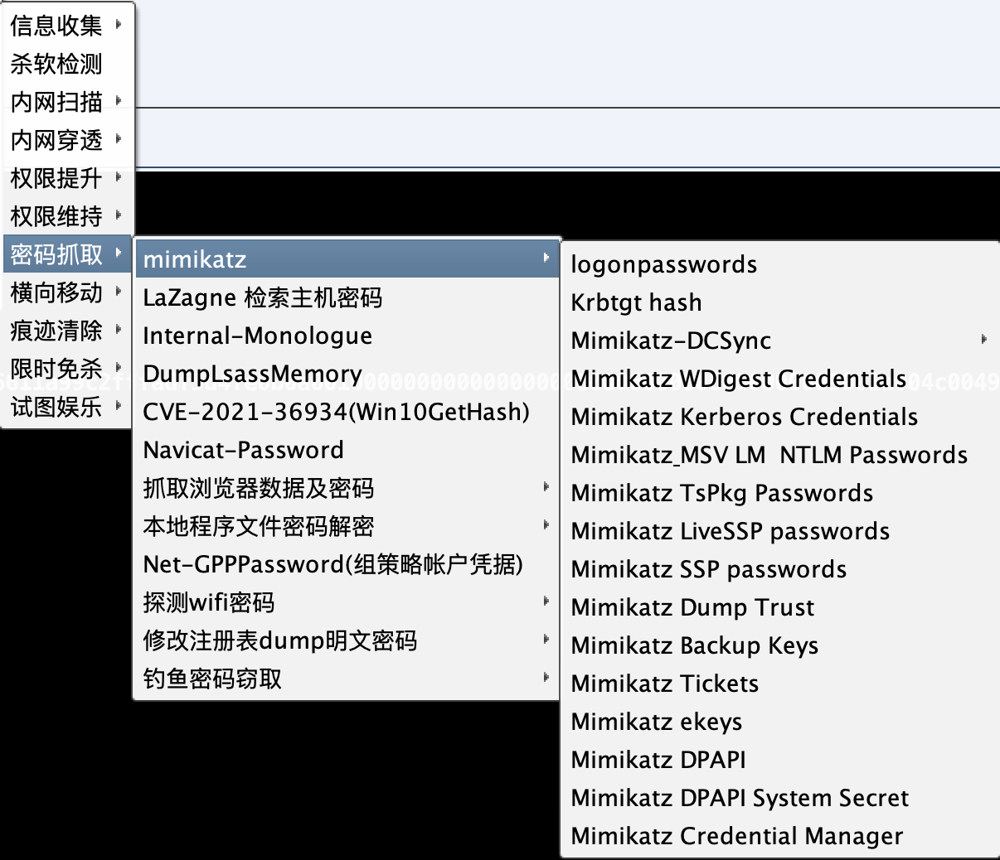

### Lazagne

**实战测试比较好用的检索主机密码工具 （上传运行后会自动删除 exe 文件）**

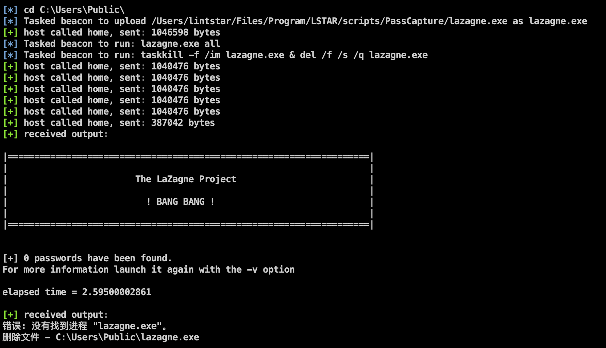

### 浏览器密码

### Navicat Xshell 等本机软件

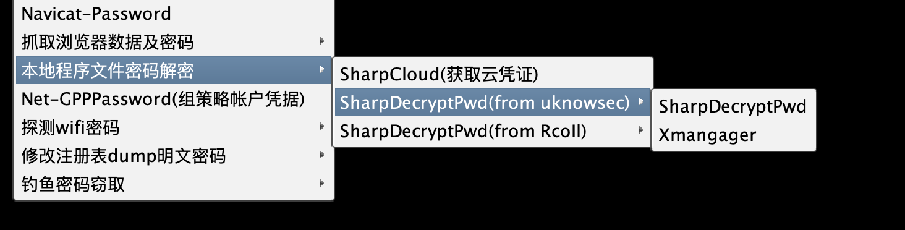

### FakeTheScreen

**优化了针对 Windows10和 Windows7不同的钓鱼密码窃取**

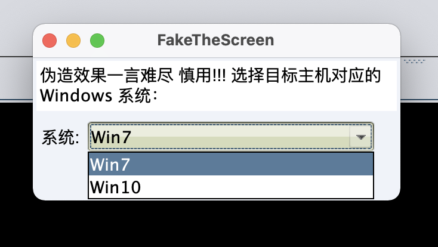

**由于伪造页面效果一言难尽，只建议在准备鱼死网破时使用：**

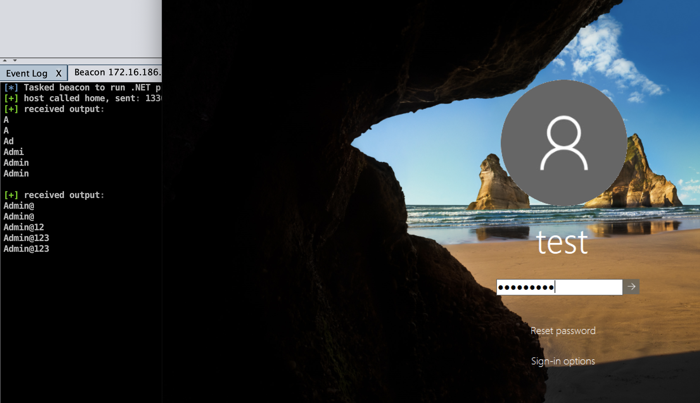

## AboutMe

**添加了 AboutMe 帮助菜单**

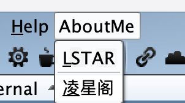

**可以跳转 凌星阁**

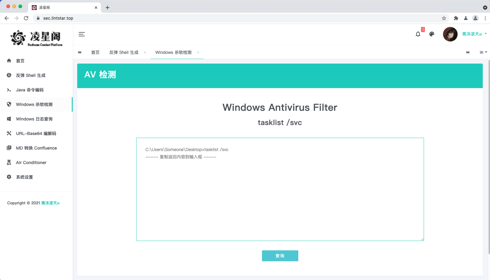

# Reference

[**梼杌 - taowu-cobalt-strike**](https://github.com/pandasec888/taowu-cobalt-strike)

[**Z1-AggressorScripts**](https://github.com/z1un/Z1-AggressorScripts)

[**九世自开 csplugin**](https://github.com/422926799/csplugin)

# InfoCollect

**添加了 Netview 和 Powerview 功能**

# AvSearch

**通过 Wmic 进行进程查询**

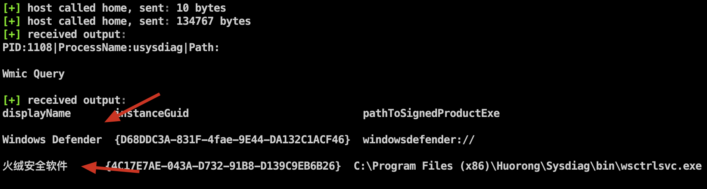

# IntrScan

**包含各类内网大保健**

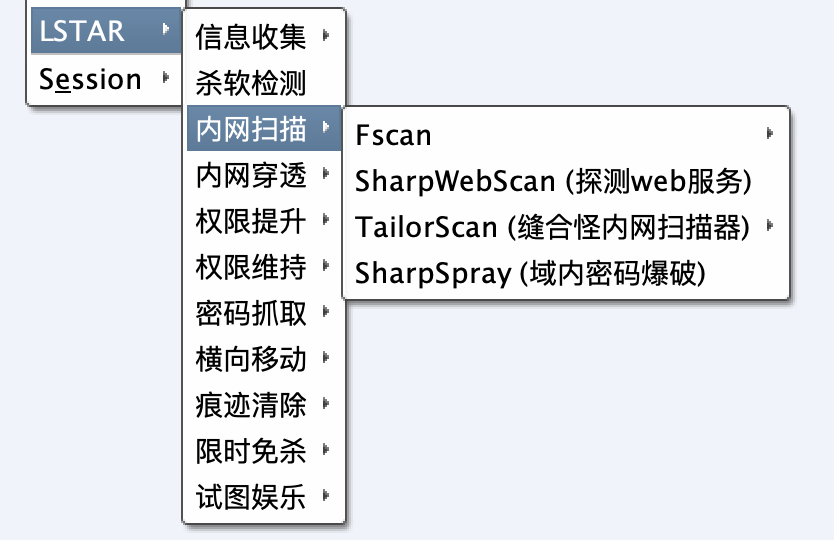

**自定义指令运行**

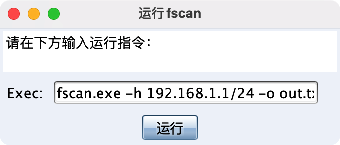

**fscan 默认上传至 `C:\\Users\\Public\\`**

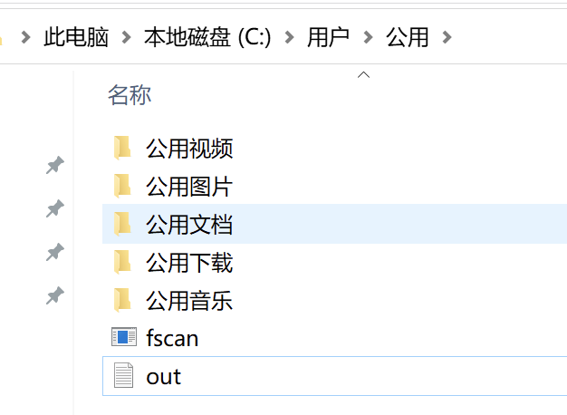

**控制台返回**

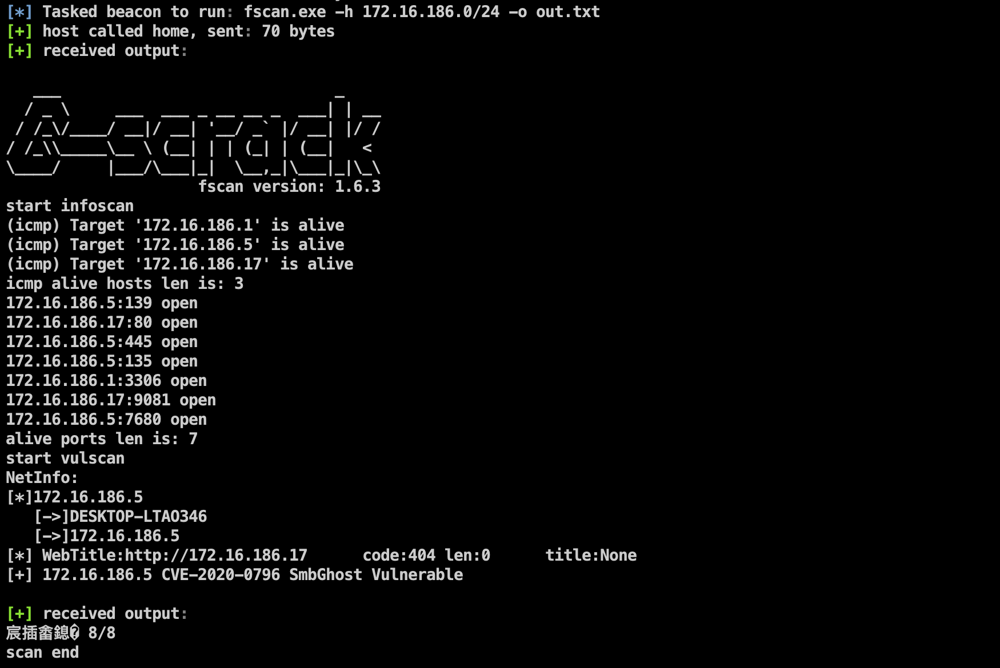

**删除 fscan 及结果文本**

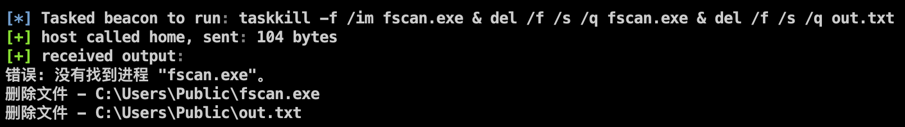

# IntrAgent

**比较好用的内网穿透工具 且均无配置文件落地 降低被溯源风险**

# AuthPromote

**只缝合了梼杌的提权 EXP 后续待完善**

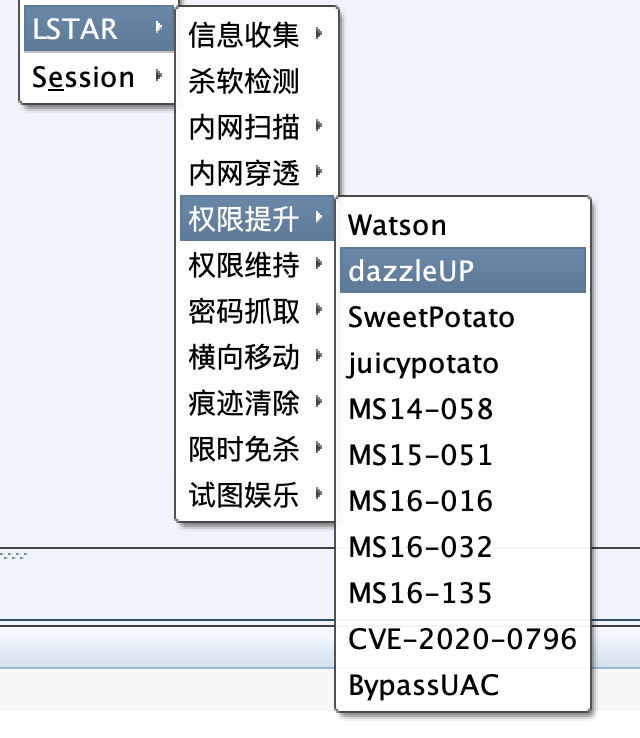

# AuthMaintain

**在梼杌的基础上 添加了白银票据和黄金票据**

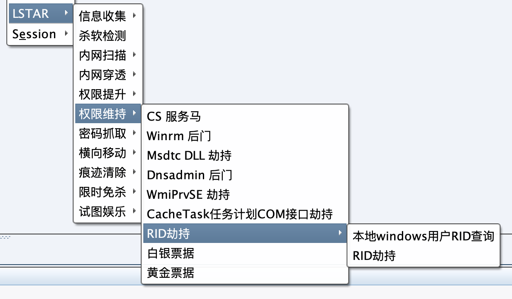

# PassCapture

**各类密码抓取**

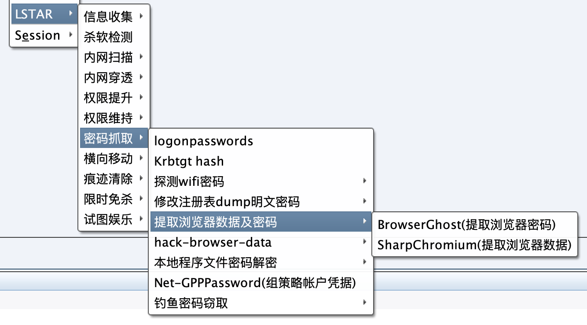

# LateMovement

**包含 基于135端口的sharpwmi 等横向移动套件**

# TraceClean

**缝合九世的痕迹清理 待完善**

# BypassCxk

**cxk 限时免杀版 adduser 和 mimikatz**

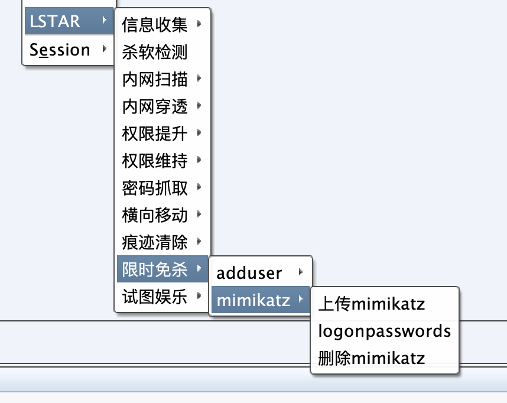

# HavingFun

**搞站的日子里图一乐**

